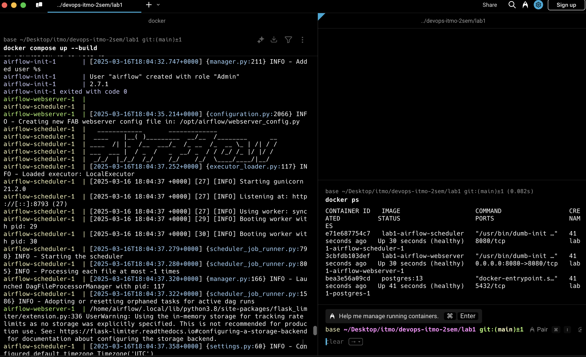
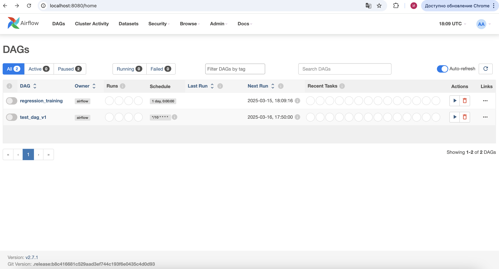
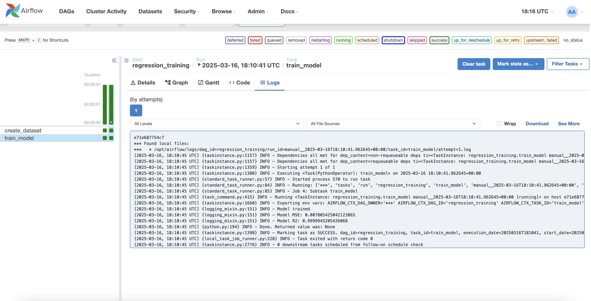

# Лабораторная 1

## Задача

Развернуть Apache Airflow с помощью docker-compose и разработать свой DAG.

## Решение

Скопируем `docker-compose.yml` с [официального сайта](https://airflow.apache.org/docs/apache-airflow/2.7.1/docker-compose.yaml) и вырежем ненужные сервисы.

Далее делаем все по инструкции, а также закомментируем директиву `image` и расскоментируем `build`:
```dockerfile
...
x-airflow-common:
  &airflow-common
  # In order to add custom dependencies or upgrade provider packages you can use your extended image.
  # Comment the image line, place your Dockerfile in the directory where you placed the docker-compose.yaml
  # and uncomment the "build" line below, Then run `docker-compose build` to build the images.
  #image: ${AIRFLOW_IMAGE_NAME:-apache/airflow:2.10.5}
  build: .
...
```

Создадим `Dockerfile`:
```Dockerfile
FROM apache/airflow:2.7.1

WORKDIR /airflow

COPY requirements.txt .
COPY dags/ /airflow/dags/

RUN pip install --no-cache-dir -r requirements.txt
```

Так как мы используем `LocalExecutor`, то нужно установить зависимости, требующиеся для запуска DAG-а.

#### DAG

Также добавим сам DAG, состоящий из двух python операторов: в одном создаем датасет, а в другом обучаем линейную регрессию на этом датасете и выводим метрики. Его можно найти в файле [`dags/lab1.py`](dags/lab1.py).

#### Запуск

Чтобы запустить, используем команду:
```bash
docker compose up --build
```

Скриншот запуска:


Чтобы открыть интерфейс, заходим на `localhost:8080` и логинимся с кредами `airflow:airflow`:


Видим 2 DAG-а. Нам нужен `regression_training`.

Пробуем запустить DAG и смотрим логи:
```
...
[2025-03-16, 18:10:45 UTC] {standard_task_runner.py:84} INFO - Running: ['***', 'tasks', 'run', 'regression_training', 'train_model', 'manual__2025-03-16T18:10:41.962645+00:00', '--job-id', '4', '--raw', '--subdir', 'DAGS_FOLDER/lab1.py', '--cfg-path', '/tmp/tmp6a4irc2n']
[2025-03-16, 18:10:45 UTC] {standard_task_runner.py:85} INFO - Job 4: Subtask train_model
[2025-03-16, 18:10:45 UTC] {task_command.py:415} INFO - Running <TaskInstance: regression_training.train_model manual__2025-03-16T18:10:41.962645+00:00 [running]> on host e71e687754c7
[2025-03-16, 18:10:45 UTC] {logging_mixin.py:151} INFO - Model trained
[2025-03-16, 18:10:45 UTC] {logging_mixin.py:151} INFO - Model MSE: 0.007805425042123865
[2025-03-16, 18:10:45 UTC] {logging_mixin.py:151} INFO - Model R2: 0.9999945205426068
[2025-03-16, 18:10:45 UTC] {python.py:194} INFO - Done. Returned value was: None
...
```
